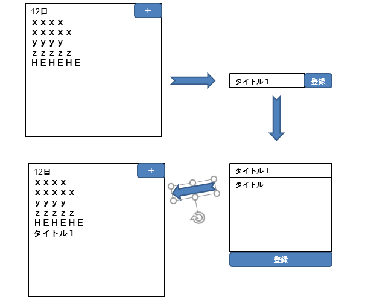
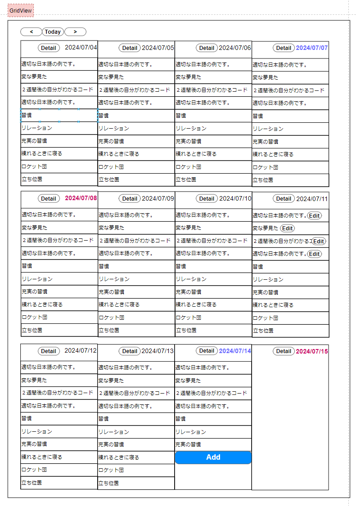
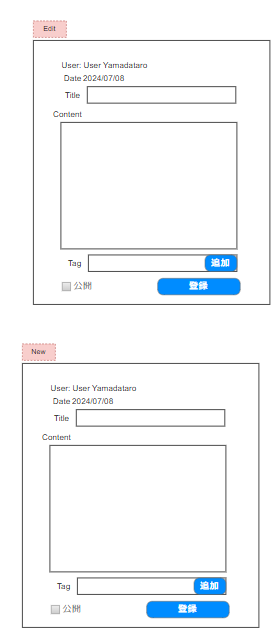
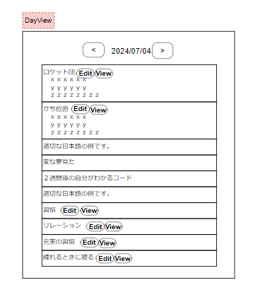
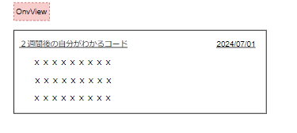
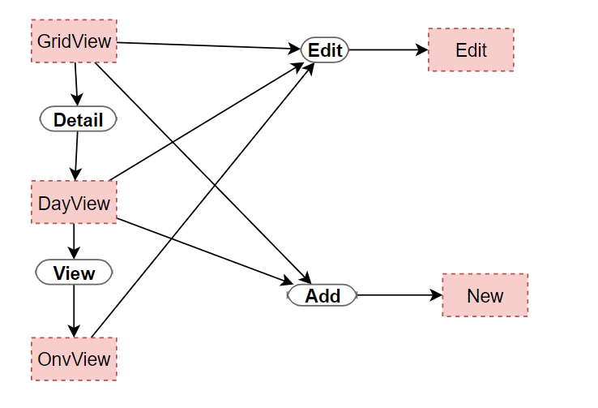
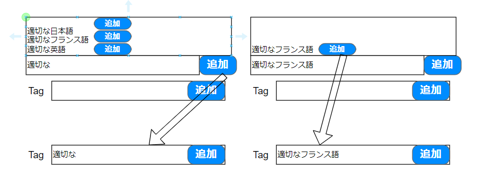
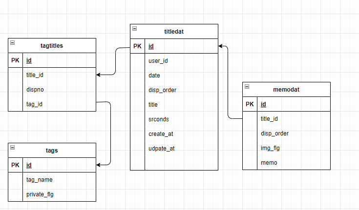
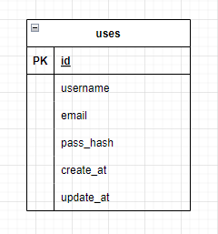

### 概要
### 目的
### デプロイ
- Ｗｅｂ：ｘｘｘｘ
- ＤＢ：ｘｘｘｘ
- 承認：ｘｘｘｘ

### 開発環境
- ＬＡＮＧ：ＪＳ
- ＦＷ：ＮｅｘｔＪＳ
- ＤＢ：ｘｘｘ

### 要件
- ゼロ秒思考用のツールの作成
- メモについては、Private分については公開しない
- 誰でも利用できるようにする。
- Private分については暗号化する
- 時間等の進捗は確認できるようにしたい

# 実装上の懸念

# 実装手順
## □ユーザー周り
### サインアップ
1. ：メールアドレス登録
1. ：メールアドレスに登録URL着
1. ：登録URL参照
1. ：ユーザー名、日本語名、パスワード登録
### ログイン
1. ：ユーザー名入力
1. ：パスワード入力
1. ：ログイン
### パスワード失念
1. ：メールアドレス入力
1. ：メールアドレスに登録URL着
1. ：登録URLでパスワード入力
### メールアドレス変更
1. ：ログイン
1. ：ユーザー情報編集
1. ：メールアドレス変更
## zstpost登録　
zst：ゼロ秒思考
### GridView
1. 日付制御
2. ダミーで作成
3. データ取得
4. データ展開
5. 日付遷移
6. 画面サイズ（行数、列数）調整

### DayView
1. ダミーで見た目の作成
2. データの入手
3. データの展開

### OneView
1. ダミーで見た目の作成
2. データの入手
3. データの展開

### New
1. データ登録テスト
2. データ登録
3. 遷移先の調整

### Edit
1. データ登録テスト
2. データ登録
3. 遷移先の調整

### Tag
1. Tagの動きサンプル
2. Tagの登録
3. Poastに付随したタグの登録

### Summary
1. 画面案作成
1. ダミーデータでの作成
1. 実データでの作成

### WordCloud作成
1. 画面案作成
1. ダミーデータでの作成
1. 実データでの作成

## スタートページ用マスタ

## データ取り込み
- 元々、Notionに登録されたデータをどうすれば、簡単に取り込むことができるか・・・
- 3週間ぐらいデータはため込んでいる。
- 取り込み用のアプリ作るか
- Notion→CSVファイル（手動）→取り込みが楽かなと思い中
- 乗り換えるタイミングは精査が必要なので、基本的にはファイル単位で情報もつこと
    - ファイル名は自由
        - 20240701-20240704.csv 20240705.csv 等を想定
    - 列は日付、タイトル、コンテンツ（1行）
        -   一行単位でデータも落とすように、画像、MDも考慮に入れる必要あり
    - 取り込み処理で重複は行わないようにする。
        - 再取り込みしても重複しないこと
    - Privateで登録 Public=0を想定
    - 専用の画面を準備する。ログイン後のみ利用可能

### コンテンツ一覧

# 画面イメージ

## GridView

## Edit/New

## DayView

## OneView

# 画面フロー

# タグ入力周り

テキストフィールドでのタグの追加パターン
https://goodpatch-tech.hatenablog.com/entry/tag-input-ui-patterns#%E3%83%86%E3%82%AD%E3%82%B9%E3%83%88%E3%83%95%E3%82%A3%E3%83%BC%E3%83%AB%E3%83%89%E5%86%85%E3%81%AB%E8%BF%BD%E5%8A%A0%E3%81%95%E3%82%8C%E3%81%A6%E3%81%84%E3%81%8F%E3%83%91%E3%82%BF%E3%83%BC%E3%83%B3

# ER図

]

